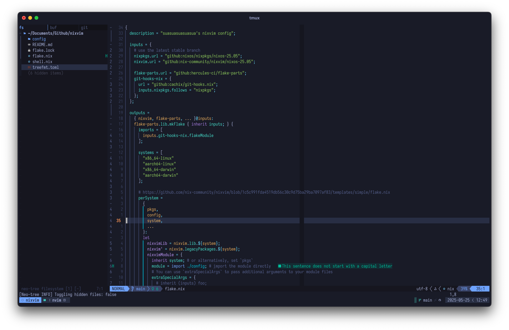

# `nixvim`

My personal `neovim` (powered by standalone `nixvim`) distribution (kind of but
not really). My setup is heavily inspired by the [kickstart.nvim
repository](https://github.com/nvim-lua/kickstart.nvim).

<!-- NOTE: update with images as larger changes come through -->


## Build

See `cachix` build artifacts
[here](https://app.cachix.org/cache/suasuasuasuasua#pull).

## Testing your new configuration

To test your configuration simply run the following command

```nix
nix run .
```

To verify if the `nixvim` configuration is correct beforehand:

```nix
nix flake check
```
