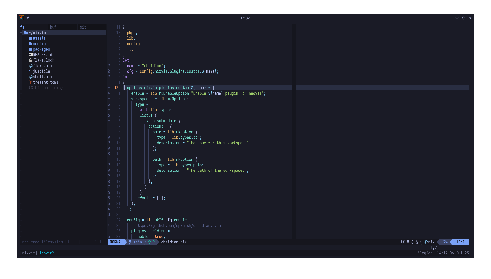

# `nixvim`

My personal `neovim` (powered by standalone `nixvim`) distribution (kind of but
not really). My setup is heavily inspired by the [kickstart.nvim
repository](https://github.com/nvim-lua/kickstart.nvim).

This is a NixVim translation of the plain-Lua Neovim config at
[sua/dotfiles](https://gitea.sua.dev/sua/dotfiles) (`nvim/.config/nvim/`). The
repo root mirrors the dotfiles structure (`lsp/`, `nix/` in place of `lua/`,
`ftplugin/`). Nixvim-specific additions (performance tweaks, nil_ls, extra LSP
servers) live in `nixvim.nix`.

<!-- NOTE: update with images as larger changes come through -->


## Build

See `cachix` build artifacts
[here](https://app.cachix.org/cache/suasuasuasuasua#pull).

## Testing your new configuration

To test your configuration simply run the following command

```nix
nix run .
```

To verify if the `nixvim` configuration is correct beforehand:

```nix
nix flake check
```
